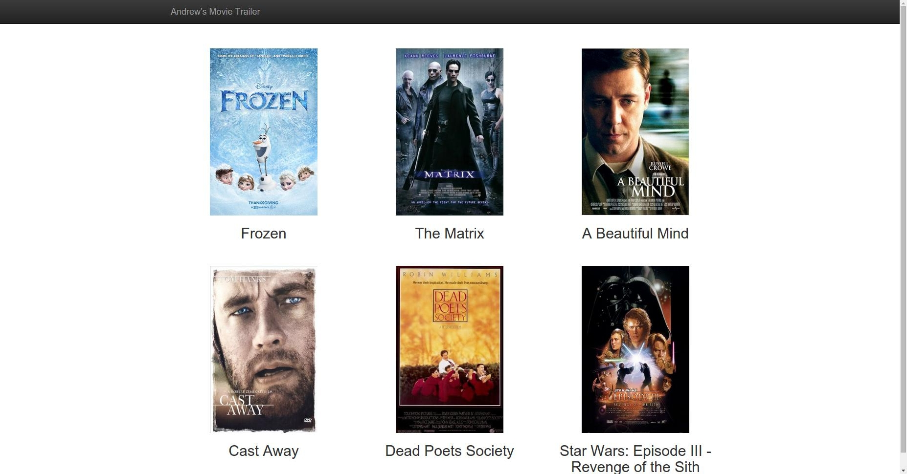
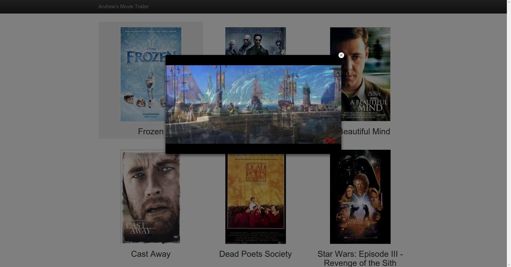

# fsnd-project1

This is the project 1, Movie Trailer Website, for Udacity's Fullstack Nanodegree. 
The website will list my 6 favorite movies with the titles, poster images, and YouTube trailers. OMDB and YouTube APIs are used to fetch poster images and trailer video urls.


<h3>To obtain</h3>
(1) Download the compressed folder by clicking 'Download ZIP' button on right side <br><br> or <br><br> (2) Clone the repository to a local directory by typing the below command in terminal
```
git clone https://github.com/andrewjjung47/fsnd-project1.git
```

<h3>To view the website</h3>
Open fresh_tomatoes.html in a browser. Click a poster image to view the YouTube trailer.


<h3>To run the website</h3>
Running entertainment_center.py will generate an HTML for the website and open it in a browser. 

The version on this GitHub does not contain a YouTube API. Obtain a YouTube API key (https://developers.google.com/youtube/registering_an_application). Create api_key.py in the same directory and put the YouTube API key in a variable YOUTUBE_API_KEY. 

